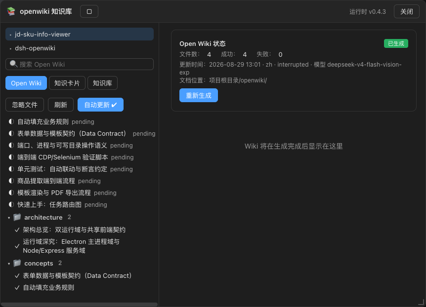
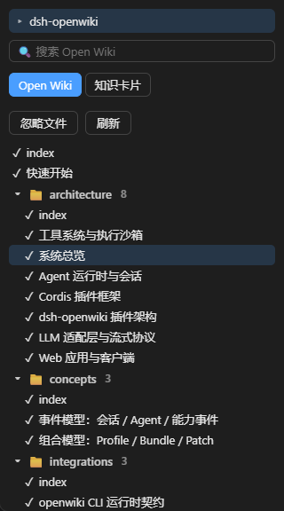
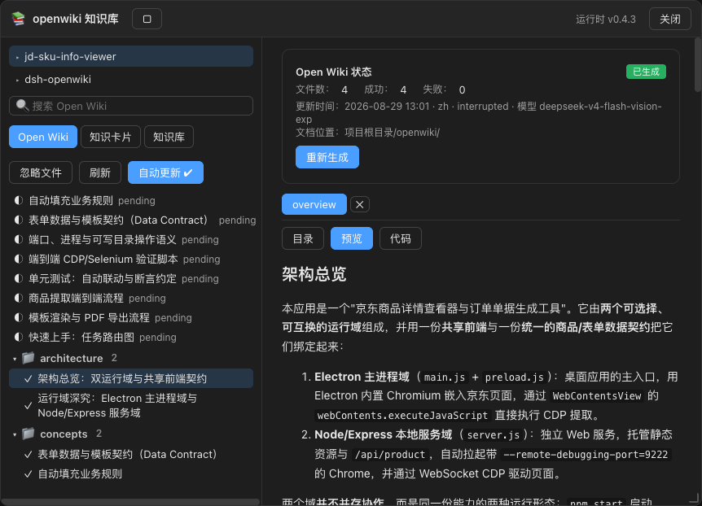
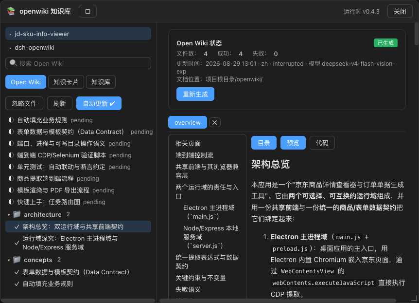
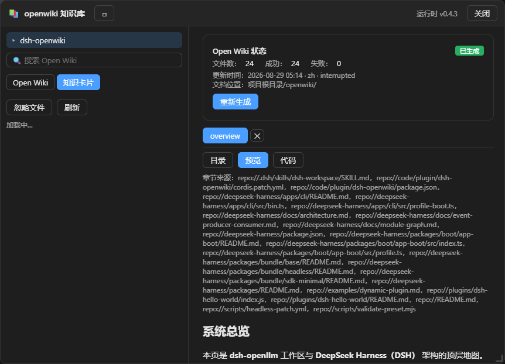
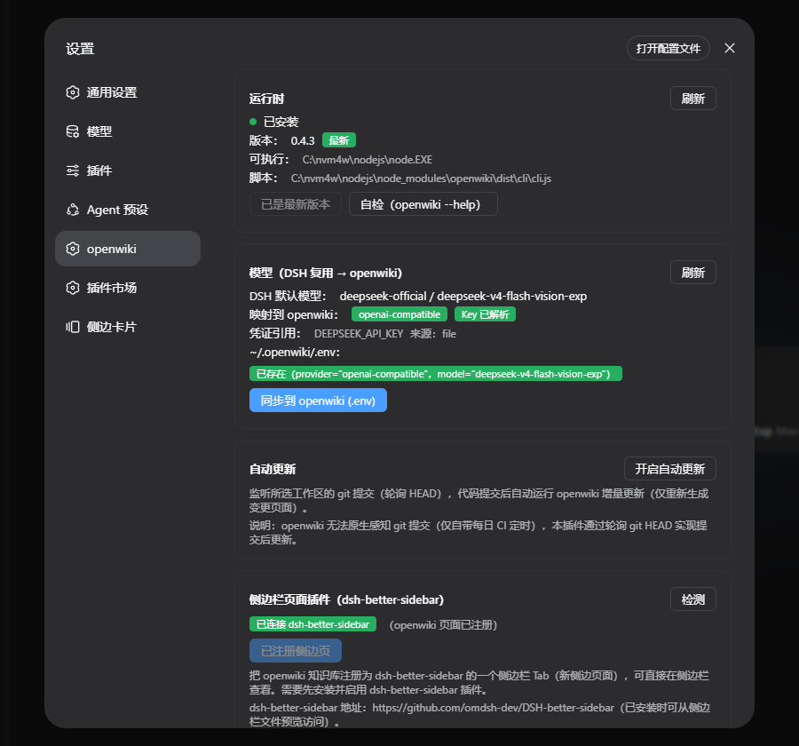

<p align="center">
  <strong>简体中文</strong> | <a href="README.en.md">English</a>
</p>

当前为开发测试版，可能存在各种问题请谨慎使用，后续更新1.0.0为正式版

# dsh-openwiki

> DSH 插件：把 [openwiki](https://github.com/langchain-ai/openwiki) 的代码库知识库能力搬进 DeepSeek Harness —— 一键生成 / 阅读 / 更新仓库 Wiki 与 Grounded Claims（溯源知识卡片），**直接复用 DSH 已配置的模型**，无需二次填 Key。

`dsh-openwiki` 是 DeepSeek Harness（Cordis 全插件架构）的 **Web profile 包插件**：Host 半部托管 openwiki CLI 运行时并驱动生成任务，Client 半部在 DSH 主界面提供知识库入口、浮动窗口、目录树、文档阅读等交互。核心思路是**把 openwiki 当作增量生成引擎**（命令行 + 磁盘产物契约），DSH 侧负责 UI、任务编排、模型桥接与触发器。

***

## 📑 目录

* [🚀 安装](#-安装)

* [🛠️ 开发与维护](#-开发与维护)

* [✨ 功能一览](#-功能一览)

* [🧱 架构设计](#-架构设计)

* [🖼️ 特性巡礼](#-特性巡礼)

* [🧠 关键逻辑](#-关键逻辑)

* [📡 RPC API](#-rpc-api)

* [⚠️ 已知限制](#-已知限制)

* [🧪 验证脚本](#-验证脚本)

***

## 🚀 安装

前置依赖：Node ≥ 20、openwiki CLI（插件可自动安装）、DSH 已配置模型与凭证。

### 方式一：npm 包（推荐）

```powershell
dsh plugin --profile web add dsh-openwiki
```

### 方式二：本地源码

```powershell
# 1. 获取源码到本地任意目录（下文以 <源码目录> 指代）
git clone <仓库地址> <源码目录>

# 2. 构建产物（lib/ 与 client/）
cd <源码目录>
npm run build

# 3. 以本地目录方式安装到 DSH web profile
dsh plugin --profile web add <源码目录>
```

### 安装后配置（两种方式相同）

```powershell
# 编辑 <你的 DSH 用户目录>\profiles\web\cordis.patch.yml，追加：
# - id: dsh-openwiki
#   name: 'dsh-openwiki'
# 重启 dsh web
```

> 说明：
>
> * 本地目录方式安装时，`dsh plugin add` 会在 profile 的 `node_modules` 下建立指向 `<源码目录>` 的链接（pnpm 目录安装默认行为），改源码 + `npm run build` 后重启 dsh web 即生效
>
> * `dsh.profile.bundles` 需含 `dsh-openwiki`（dsh.client manifest：platform web，peerDependency schemastery）

***

## 🛠️ 开发与维护

### 目录结构

```
<源码目录>/
├── src/host/index.js        # Host 权威源码（动态/包共用）
├── src/client/index.js      # Client 权威源码
├── scripts/build-host.mjs   # → lib/index.js（ESM 入口）
├── scripts/build-client.mjs # → client/client.js（ModuleLoader bundle）
├── lib/  client/            # 构建产物
├── tests/                   # Playwright / 离线验证脚本 + screenshots/
└── package.json             # dsh.client manifest（platform web）
```

<br />

### 面向 AI 的注意事项

* **构建脚本改写**：build-host 把 `harness.handle` 换成 `rpc.handle` 并注入 `webServer`/`settings`；build-client 把 `host.call` 换成 `rpc.call`。新增 Host handler 用 `harness.handle(...)`，新增 Client 交互用 `host.call(...)`，构建自动适配

* **readBytes 限制**：`fs.readBytes` 超限会抛错（不是截断）——读文件头用 `readText` + slice

* **manifest 缺失是常态**：所有 wiki 读取都要走 disk-scan fallback（`readWikiTree`/`readWikiOverview`/`readWikiClaims`）

* **shim EPERM**：Windows 下不要 spawn `.cmd`，解析 shim 内脚本路径直接 spawn node

* **not found 静默**：可选状态文件缺失（`.page-manifest.json`/`.run.json`/`.last-update.json`）不要 `console.error`，否则轮询刷屏

* **settings 命名空间**：`settings.register('openwiki', schema)` 依赖 `@deepseek-ai/schemastery`，从 profile 动态 import 可能失败（`settings namespace skipped`）——不依赖它，用内存态 + localStorage

* **client 服务注册表每次刷新重建**：better-sidebar 注册必须自动重注册（autoRegisterSidebar），不能依赖用户点击

* **openwiki 无 git 触发器**：自动更新靠插件轮询 `git rev-parse HEAD`

* **非 git 仓库无法生成**：`startJob` 前置校验已拦截并报明确错误

* **Markdown 渲染**：fence 检测必须 `startsWith('```')`（见「🧠 关键逻辑」死循环教训）

* **性能**：空闲轮询只刷 jobs + overview（轻量），有运行任务才全量 `refreshWorkspace`；避免每 3s 全量磁盘扫描

***

## ✨ 功能一览

* **📚 知识库入口**：DSH 主界面左下角「设置」上方「openwiki知识库」入口（可关闭，`localStorage` 持久化），点击打开可拖拽/可缩放的**浮动窗口**；另有「conversation.view」会话视图 Tab 与 better-sidebar 侧边页面两种嵌入形态。**工作区列表每次打开知识库/点击「刷新」都实时重新拉取**（新增工作区无需刷新页面）

  

* **🗂️ 双模式视图**：`Open Wiki`（仓库 Wiki 文档树）与 `知识卡片`（Grounded Claims 溯源抽点）两个常驻 Tab，选中高亮；另有「忽略文件」「刷新」按钮；左栏宽度可拖动调整

  

* **📄 文档阅读**：预览 / 代码双视图 + **目录分栏**（点击「目录」在工具栏下方分出左侧目录面板，独立竖滚动条、sticky 不随正文滚动；点条目平滑滚动到对应标题）

  

  

* **🗂️ 知识卡片**：Grounded Claims 溯源抽点（statement + evidence），点「知识卡片」Tab 查看

  

* **🔗 应用内链接导航**：md 内链（含 `/openwiki/...` 绝对路径）点击后在应用内跳转，绝不把浏览器带走到 `file://`；目录链接（尾 `/`）进入文件夹浏览

* **⚡ 生成任务**：生成 / 重新生成（增量更新）/ 取消，实时进度（`已完成 X/Y (Z%)，处理中: N，失败: M`），断点续跑依赖 openwiki 的 `.run.json`；非 git 仓库明确报错

* **📊 生成状态卡**：右侧展示文件数 / 成功 / 失败 / 更新时间 / 文档位置（`openwiki/`）与「重新生成」按钮

* **🔌 模型复用**：读取 DSH 默认模型（`agentDefaultModel`）与凭证，映射为 openwiki 的 provider 配置写入 `~/.openwiki/.env`（openai-compatible / anthropic / gemini / openrouter）

* **🖥️ 运行时托管**：自动检测 openwiki CLI（解析 npm shim）、版本检查（registry）、安装 / 升级 / 自检（`--help`）

* **🔔 自动更新**：轮询所选工作区 git HEAD，检测到新提交自动跑增量更新（openwiki 无原生 git 触发器，由插件补上）

* **🧩 better-sidebar 集成**：检测到 `dsh-better-sidebar` 服务即**自动注册**一个侧边页面（刷新后自动重注册，等效持久化）；未安装时设置页给出安装指引

* **🛡️ 忽略文件**：`.openwikiignore`（gitignore 语法）图形化编辑保存

* **⚙️ 设置页**：运行时 / 模型 / 自动更新 / better-sidebar 注册 / 入口显隐

  

> 🔌 **核心理念**：openwiki 是 CLI 引擎，DSH 是宿主。一切状态（`openwiki/` 目录下的 `.page-manifest.json` / `.run.json` / `.last-update.json` / `.claims/`）都是磁盘契约，插件只做**读取 + 展示 + 触发**，不干预生成算法本身。

***

## 🧱 架构设计

### 双半结构（Host / Client）

Cordis 插件分两半，各自有**权威源码**，构建脚本生成包产物：

| 半部     | 权威源码                  | 构建产物                                        | 职责                                                          |
| ------ | --------------------- | ------------------------------------------- | ----------------------------------------------------------- |
| Host   | `src/host/index.js`   | `lib/index.js`（ESM 入口）                      | openwiki 运行时托管、模型桥接、生成任务、wiki/claims 磁盘读取、忽略文件、自动更新、RPC 服务端 |
| Client | `src/client/index.js` | `client/client.js`（Web ModuleLoader bundle） | 全部 UI：入口、浮动窗口、目录树、文档渲染、设置页、better-sidebar 注册                |

构建脚本（`scripts/build-host.mjs` / `build-client.mjs`）把源码中的自由标识符改写为包形态：

* Host：`harness.handle(` → `rpc.handle(`；`lib/index.js` 注入 `webServer`/`settings` 硬依赖并注册 `/dsh-openwiki/rpc` 同源 JSON-RPC 路由

* Client：`host.call(` → `rpc.call(`（`fetch('/dsh-openwiki/rpc', { headers: {'x-dsh-openwiki':'1'} })`）；`styles.insert` → 本地 `<style>` 注入

> 开发期还可用「插件开发模式」的 cordis\_define/run 把 `src/` 当动态插件直接跑，两种形态共用同一份源码。

### 通信桥（Client ↔ Host RPC）

```
Client bundle ──fetch──▶ /dsh-openwiki/rpc (webServer, kind: exact)
                          ├─ 请求头 x-dsh-openwiki: 1（防 CSRF，跨站无法自设）
                          ├─ body: { method, args }
                          └─ 响应: JSON（handler 返回值或 { ok:false, error }）
```

Host 侧 `handlers` Map 注册 20+ 方法（见「📡 RPC API」），全部 fiber 绑定（`ctx.effect` 自动回收）。

### 客户端状态管理（closure store）

Client 用轻量订阅 store（`createKbStore`，非 Redux）承载全部 UI 状态，各 Slot 组件通过 `useKb()` 订阅：

```
state = {
  open, runtime, model, busy, action, lastOutput,
  workspaces[], selected, overview, tree, page, claims, jobs[],
  tab ('wiki'|'cards'), search, tabs[] (文档多 Tab), activeTab,
  browseDir, docView, tocOpen, showIgnore, ignoreContent, error,
  win {x,y,w,h,max}        ← 浮动窗口几何
  expandedDirs {}          ← 目录树折叠状态
  sidebar, sidebarRegistered, showEntry,
  autoUpdate {enabled}
}
```

### Slot 注册清单（Client）

| Slot                    | id                   | 说明                                          |
| ----------------------- | -------------------- | ------------------------------------------- |
| `sidebar.footer.action` | `openwiki`（order 10） | 左下角「设置」上方入口（`showEntry=false` 时隐藏）          |
| `shell.overlay`         | `openwiki-kb`        | 浮动窗口宿主（`.owk-win`，可拖拽/缩放/最大化）               |
| `conversation.view`     | `openwiki`（order 20） | 会话区域的知识库视图 Tab                              |
| `settings.section`      | `openwiki`（order 30） | 设置页：运行时 / 模型 / 自动更新 / better-sidebar / 入口显示 |

***

## 🖼️ 特性巡礼

### 浮动窗口（`shell.overlay`）

知识库不是全屏层而是**可拖拽/可缩放窗口**，便于边看文档边对话：

* 几何存于 `kb.win {x,y,w,h,max}`；header `onMouseDown` 起拖动（document `mousemove/mouseup` 跟随），右下角 `.owk-win-resize` 手柄缩放（东南角锚定），`□/▣` 最大化

* **视口 clamp**：拖动/缩放都经 `clampWin(x,y,w,h)`——窗口顶/左边永远 `>= 0`，尺寸 clamp `360..vw` × `240..vh`，超视口时收缩。避免标题栏被拖出浏览器顶部导致窗口不可抓回

* 窗口 z-index 99999，CSS 见 `.owk-win*`

* 关闭按钮放标题旁（避开 better-sidebar 右上角 rail 的遮挡）

### 双模式 Tab 与按钮布局

* 左栏第一行：`Open Wiki` / `知识卡片` 常驻 Tab（`.owk-tab.sel` 高亮，无 emoji）

* 左栏第二行：`忽略文件` / `刷新`

* **左栏宽度可拖**：`.owk-kb-resizer` 分隔条（`col-resize` 光标），拖动更新 `kb.leftWidth`（clamp 220–520px，状态存内存）

* 搜索框 placeholder「🔍 搜索 Open Wiki」，对树做前缀父目录冒泡过滤（`filterPages`）

### 可折叠目录树

* `buildTree(pages)` 把相对路径构造成 `{path, dirs{}, pages[]}` 树，目录节点带稳定 `path` key

* `expandedDirs {}` 记录折叠态，`toggleDir` 切换；`expandAllDirs` 在树加载时**默认全展开**

* 排序：页面 `index`/`quickstart`（根级）权重最优先渲染在目录之前，其余按 title 字母序

* 点击文档 → `openPage(path)`（保留 `.md` 后缀，host 侧对无后缀输入有兜底）；点击目录 → `browseDirectory` 在右侧列出该目录文件

### 文档阅读与目录分栏

* 视图切换顺序 **目录 / 预览 / 代码**；「目录」toggle `tocOpen`，在工具栏下方**分栏**：左侧 `.owk-toc-pane` 目录面板（`overflow-y: auto` 独立竖滚动条 + `position: sticky` 不随正文滚动，`max-height: calc(100vh - 240px)`），右侧 `.owk-doc-main` 为正文

* 点目录条目 → `goToHeading(i)`：切回预览、`setTimeout` 后 `scrollIntoView('owk-h-i')`（锚点由 `renderMarkdown` 按 h2-h4 顺序编号），面板保持打开可连续跳转

* 代码视图原样展示 Markdown 源文

### 应用内链接导航

md 渲染（`renderInline`）把内部链接渲染为 `.owk-wiki-link`（`onClick + preventDefault` 拦截）：

```
href 判定:
  http(s)/mailto/…  → 新窗口
  尾 "/" 或 /openwiki/xxx/ → browseDirectory（文件夹浏览）
  其它 → openWikiLink(href)
    ├─ 剥离 /openwiki/ 前缀（与 host 树读取同一约定）
    ├─ 绝对路径不拼当前页目录；相对路径拼当前页目录
    └─ 归一化 ./ ../ → openPage(目标)
```

### 生成任务（Host `JobDriver`）

`startJob({workspaceId, mode, language})`：

1. **前置校验**：workspace 存在、无并发任务、`readGitHead` 非空（非 git 仓库直接报错）、模型桥接就绪（写 `.env`）、CLI 可解析
2. `subprocess.spawn(openwiki --init|--update -p -l <lang>)`，cwd=工作区路径
3. 每 2s 轮询 `openwiki/.run.json`（`readRunState`）更新 `phase/total/done/pending/failed`；结束读 `.last-update.json`
4. 完成后 120s 延迟从 jobs Map 清理；client 每 3s `refreshJobs` 拉状态
5. Client 检测到 error 状态的 job → 写 `kb.error`（醒目红字提示，避免"生成中很快消失无提示"）

### Wiki 读取（manifest 缺失 fallback）

openwiki 正常产出 `.page-manifest.json`，但**边缘场景（init 中途 finalize）该文件缺失**——此时所有读取走**递归磁盘扫描**：

| 数据                 | manifest 缺失时的来源                                               |
| ------------------ | ------------------------------------------------------------- |
| `readWikiTree`     | 递归扫 `openwiki/` 下 `.md`，逐文件读 frontmatter title                |
| `readWikiOverview` | 递归计数 `.md` 得 `pageCount`/`successCount`；`failedCount` 取最近 run |
| `readWikiClaims`   | 扫 `openwiki/.claims/*.json`（与 manifest 页面清单对应）                |

### 模型桥接（M2 核心）

`buildOpenWikiEnv()`：

```
agentDefaultModel.currentSelection() → {provider, model}
  ├─ deepseek-official/deepseek → openai-compatible + DEEPSEEK_API_KEY
  └─ pi-ai providers[provider]   → 按 api 字段映射 anthropic/gemini/openrouter/openai-compatible
credentials.resolve(apiKeyEnv)    → 真实 Key（source: env/credentials.yaml/user-env）
applyEnvUpdates()                 → 写 ~/.openwiki/.env（只更新 MANAGED_ENV_KEYS，保留其它键）
```

### 自动更新（git HEAD 轮询）

openwiki **没有** git 提交触发（无 hook/无文件监听，仅自带每日 CI cron 工作流）；DSH 也没有 git 钩子服务。插件自实现：

* Host `startAutoUpdate(workspaceId)`：每 15s `readGitHead`（`git rev-parse --verify HEAD`），与上次比较；变化即 `startJob({mode:'update'})`（增量：openwiki 按 `lastUpdate.gitHead` 与 `git diff` 只重生成变更页）

* 开关在设置页「自动更新」卡片，`openwiki/autoupdate/set|status` RPC

### better-sidebar 自动注册

`ctx.get('betterSidebar')` 是 better-sidebar 插件提供的客户端 Cordis 服务（`registerTab`/`getTabs`/…）：

* **自动注册**：`apply` 尾部 `timer.interval(400ms, ≤12 次)` 轮询服务出现，出现即 `registerTab({id:'openwiki', title, icon, order:50, single:true, component: SidebarKbView})`

* 客户端服务注册表**每次页面加载重建**，所以刷新后自动重注册 = "持久化"；设置页手动按钮保留（幂等，注册后显示「已注册侧边页」）

* 未检测到时设置页给出安装指引与仓库地址

***

## 🧠 关键逻辑

### Host 端（`src/host/index.js`）

| 区域                                                                      | 行号（约）                  | 说明                                                                                               |
| ----------------------------------------------------------------------- | ---------------------- | ------------------------------------------------------------------------------------------------ |
| `readText`                                                              | 24                     | 统一读文件；**not found 静默返回 null**（可选状态文件缺失是常态，避免刷屏）                                                  |
| `resolveCli`                                                            | 47                     | 解析 openwiki 可执行：Windows npm shim 里解析 `node "%~dp0\...\cli.js"` 直接 spawn node（spawn .cmd 会 EPERM） |
| `resolveNpm` / `readVersion` / `readLatest`                             | 105 / 137 / 152        | npm 解析、版本读取、registry 最新版（失败只记一次）                                                                 |
| `runtimeStatus` / `install` / `update` / `ensure` / `probe`             | 217–272                | 运行时状态、npm 安装/升级、惰性确保、`--help` 自检                                                                 |
| `buildOpenWikiEnv` / `applyEnvUpdates` / `readOpenWikiEnvStatus`        | 331 / 426 / 453        | 模型桥接三件套                                                                                          |
| `readGitHead` / `startAutoUpdate` / `stopAutoUpdate`                    | 484 / 500 / 492        | 自动更新守护                                                                                           |
| `startJob` / `killJob` / `jobStatus`                                    | 569 / 684 / 697        | 生成任务驱动                                                                                           |
| `readWikiTree` / `readWikiPage` / `readWikiOverview` / `readWikiClaims` | 751 / 899 / 928 / 1008 | 磁盘读取（含 fallback）                                                                                 |
| `readIgnore` / `saveIgnore`                                             | 1063 / 1072            | `.openwikiignore`                                                                                |
| `workspaceOf` / `readRunState` / `readLastUpdate`                       | 525 / 535 / 558        | workspace 解析、`.run.json` 进度、`.last-update.json`                                                  |

**安全约定**：`readWikiPage` 对路径做 `replace(/^\/+/,'').replace(/\.\./g,'')` 防穿越；`saveIgnore` 限工作区路径。

### Client 端（`src/client/index.js`）

| 区域                                                 | 行号（约）           | 说明                    |
| -------------------------------------------------- | --------------- | --------------------- |
| `createKbStore` / `useKb`                          | 14 / 72         | 订阅式状态 store           |
| `openPage` / `browseDirectory` / `closeTab`        | 231 / 254 / 262 | 文档 Tab、文件夹浏览、关闭       |
| `startJob` / `killJob`                             | 281 / 294       | 任务触发（含 git 校验错误透传）    |
| `openWikiLink` / `renderInline` / `renderMarkdown` | 341 / 379 / 424 | 轻量 Markdown 渲染 + 内链导航 |
| `buildTree` / `expandAllDirs` / `renderTree`       | 558 / 578 / 592 | 目录树（折叠、index 置顶）      |
| `renderDoc` / `renderKb`                           | 676 / 778       | 文档区（目录分栏）/ 知识库主面板     |
| `registerSidebarTab` / `autoRegisterSidebar`       | 1009 / 1037     | better-sidebar 注册     |
| `toggleShowEntry` / `SidebarKbView`                | 975 / 983       | 入口显隐 / 侧边页视图          |

**Markdown 渲染注意**（维护必读）：`renderMarkdown` 的 fenced code block 检测必须是 `line.startsWith('```')`（曾用 `/^```(\S*)\s*$/`，对   ` ```ts type-equiv` 这类**带空格语言串**匹配失败，行落入 paragraph 分支又被 `!/^```/` 排除 → `i` 永不前进 → **无限循环卡死**，已在 M6.1 修复）。

***

## 📡 RPC API

全部 POST `/dsh-openwiki/rpc`，需 `x-dsh-openwiki: 1` 头。Client 的 `call(method, args)` 封装。

| 方法                                              | 参数                                                | 返回要点                                                                                                       | <br /> | <br /> | <br />                                 |
| ----------------------------------------------- | ------------------------------------------------- | ---------------------------------------------------------------------------------------------------------- | :----- | :----- | :------------------------------------- |
| `openwiki/runtime/status`                       | —                                                 | `{installed, version, latestVersion, hasUpdate, exePath, scriptPath, error}`                               | <br /> | <br /> | <br />                                 |
| `openwiki/runtime/install` / `update` / `probe` | —                                                 | \`{ok, version                                                                                             | from   | to     | output}`；probe 返回 `  --help\` 前 600 字符 |
| `openwiki/runtime/ensure` / `checkUpdate`       | —                                                 | 惰性确保 / 版本对比                                                                                                | <br /> | <br /> | <br />                                 |
| `openwiki/model/status`                         | —                                                 | `{selection, owProvider, apiKeyEnv, keyConfigured, keySource, envExists, envProvider, envModel, warnings}` | <br /> | <br /> | <br />                                 |
| `openwiki/model/sync`                           | —                                                 | 执行 `.env` 写入                                                                                               | <br /> | <br /> | <br />                                 |
| `openwiki/model/env`                            | —                                                 | 已管理 env 键值（密钥掩码）                                                                                           | <br /> | <br /> | <br />                                 |
| `openwiki/workspaces`                           | —                                                 | `{workspaces:[{id,path,title}]}`（workspaceRegistry）                                                        | <br /> | <br /> | <br />                                 |
| `openwiki/job/start`                            | `{workspaceId, mode('init'\|'update'), language}` | `{ok, jobId}`；非 git 仓库报明确错误                                                                                | <br /> | <br /> | <br />                                 |
| `openwiki/job/kill`                             | `{workspaceId}`                                   | `{ok}`                                                                                                     | <br /> | <br /> | <br />                                 |
| `openwiki/job/status`                           | —                                                 | `{jobs:[{jobId, workspaceId, status, phase, total, done, failed, message}]}`                               | <br /> | <br /> | <br />                                 |
| `openwiki/wiki/tree`                            | `{workspaceId}`                                   | `{pages:[{path,title,status}], inProgress[], scanError}`                                                   | <br /> | <br /> | <br />                                 |
| `openwiki/wiki/page`                            | `{workspaceId, path}`                             | `{content, frontmatter}`（无 `.md` 输入有兜底）                                                                    | <br /> | <br /> | <br />                                 |
| `openwiki/wiki/overview`                        | `{workspaceId}`                                   | `{pageCount, successCount, failedCount, wikiDirRelative, runActive, runPhase, runProgress, lastUpdate}`    | <br /> | <br /> | <br />                                 |
| `openwiki/wiki/claims`                          | `{workspaceId}`                                   | `{claims:[{id,statement,evidenceCount,firstEvidence,page}]}`                                               | <br /> | <br /> | <br />                                 |
| `openwiki/ignore/get` / `save`                  | `{workspaceId, content?}`                         | 忽略文件读写                                                                                                     | <br /> | <br /> | <br />                                 |
| `openwiki/autoupdate/set` / `status`            | `{workspaceId, enabled?}`                         | 自动更新开关 / 状态                                                                                                | <br /> | <br /> | <br />                                 |
| `openwiki/logs/tail`                            | —                                                 | 占位（当前返回空）                                                                                                  | <br /> | <br /> | <br />                                 |

***

## ⚠️ 已知限制

| 项                    | 说明                                                                                                        |
| -------------------- | --------------------------------------------------------------------------------------------------------- |
| settings 命名空间持久化     | `openwiki` 命名空间注册依赖 schemastery，从 profile node\_modules 动态 import 可能失败；当前实际配置走内存态 + localStorage，核心功能不受影响 |
| `latestVersion`      | 无可用 web provider 时 `readLatest` 返回 null（只记一次日志），"最新版本"提示为空                                                |
| Markdown 渲染          | 轻量实现（标题/代码块/表格/列表/引用/行内样式），Mermaid 围栏按代码块展示，不做完整 Markdown 方言                                              |
| personal 模式          | 仅支持仓库（code）模式；非 git 目录不可生成（已明确报错）                                                                         |
| 自动更新粒度               | HEAD 轮询间隔 15s，非即时；检测到新提交才触发增量更新                                                                           |
| `openwiki/logs/tail` | 占位实现（返回空），后续可接 openwiki 运行日志                                                                              |

***

## 🧪 验证脚本

| 脚本                                                                                                                       | 覆盖                                    |
| ------------------------------------------------------------------------------------------------------------------------ | ------------------------------------- |
| `tests/verify-host-entry.mjs`                                                                                            | Host 入口离线测试（name/inject/RPC 路由/鉴权/分发） |
| `tests/redesign-verify.mjs`                                                                                              | M4：浮动窗口/双 Tab/折叠树/内链跳转/设置页（23 项）      |
| `tests/link-nav-verify.mjs`                                                                                              | 内链跳转专项                                |
| `tests/sidebar-reg-verify.mjs`                                                                                           | better-sidebar 手动注册专项                 |
| `tests/autoreg-verify.mjs`                                                                                               | 自动注册 + 刷新持久化专项                        |
| `tests/round2-verify.mjs`                                                                                                | M5：按钮改名/排序/右侧状态卡/文件夹浏览/自动更新卡（16 项）    |
| `tests/round3-verify.mjs`                                                                                                | M6：目录分栏/按钮两行/trae 生成错误（11 项）          |
| `tests/fixverify.mjs`                                                                                                    | 状态误判/左侧路径/渲染回归                        |
| `tests/verify-scan.mjs` / `verify-claims-scan.mjs` / `verify-frontmatter.mjs` / `verify-reader.mjs` / `verify-final.mjs` | 离线解析验证                                |

Playwright 用法：`$env:DSH_GUI_BASE='http://127.0.0.1:3081'; node tests/<script>.mjs`（headless Chrome + playwright-core，`createRequire('C:/nvm4w/nodejs/package.json')`）。

***

*本文档基于插件开发过程整理，供后续维护与 AI 开发使用；接口契约以源码与 Cordis Inspect Provider 实时查询为准。*
